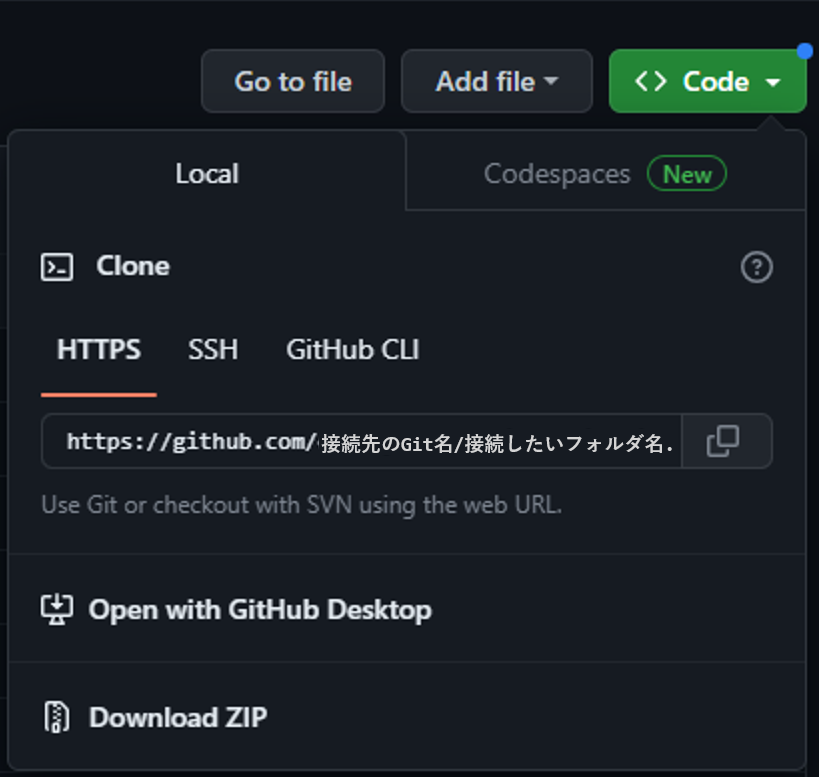
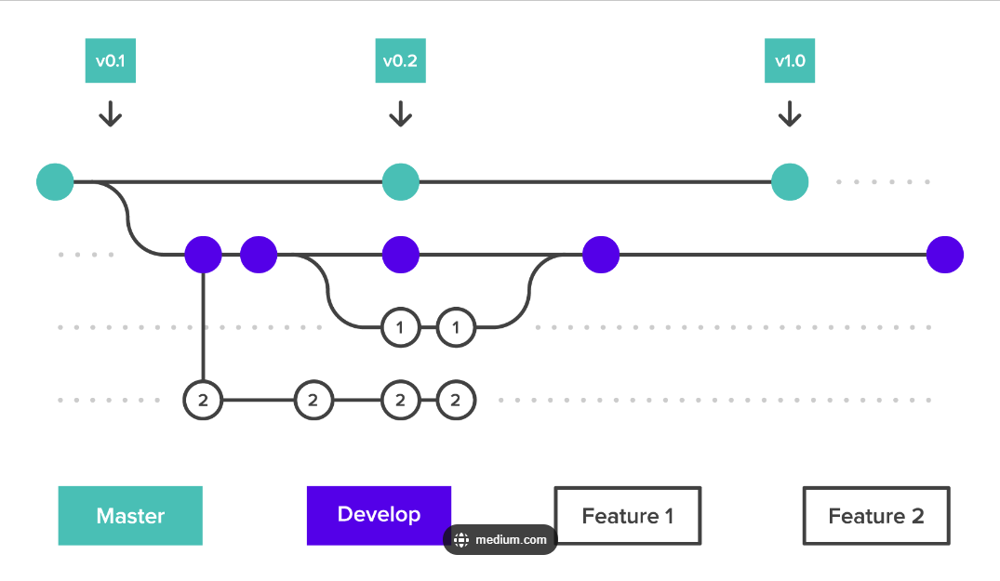

# Step1 Git flow プラグインの導入

### 概要リンク

[git-flow プラグイン](https://marketplace.visualstudio.com/items?itemName=vector-of-bool.gitflow)

## VS コードからインストール

1. 拡張機能メニューを開く
1. 検索フォームから「gitflow」を検索する
1. インストールする

## 基本的な使い方

1. Ctrl+Shift+P を押してコマンドパレットを表示
1. 「gitflow」を入力します
1. git-flow の各メニューが表示される（feature ブランチ、release ブランチの作成など）

# Step2 Git hub との同期を設定する

## 同期するフォルダを準備する

1. Git hub 上のフォルダ名と同じフォルダーをローカルに作成する
   　（例：C:\USER\ProjectA など）
1. 作成したフォルダを VS コードで開く（右クリック＞ VS コードで開く）
1. メニューのソース管理から「リポジトリを初期化する」ボタンをクリック
   ※初期化後の「ブランチの発行」ボタンは押さなくてよいです
   
1. ターミナルを開く（Ctrl+@）
1. C:\USER\開いているフォルダ名>の右隣に「git remote add origin https://github.com/接続先のGit名/接続したいフォルダ名.git」を入力する
   ※接続したいフォルダ内の Code を参照
   
1. すぐ下の行に「git pull origin master」を入力する
1. Ctrl+Shift+P を押してコマンドパレットを表示
1. 「Gitflow : Initialize repository for gitflow 」を探し Enter
1. 「main」「develop」などの表示を何も表示されなくなるまで Enter を押し繰り返す
1. 画面左下のアイコンの「master」をクリック＞「＋ develop」へ移動する
1. 左下のアイコンに「develop」と書いてあることを確認する
1. Ctrl+Shift+P を押してコマンドパレットを表示

## ファイルの編集方法

1. 「Gitflow : Feature: start」を選択して、ファイルの編集始めを宣言する
   ※develop から Feature ブランチを派生させることで、コンフリクトを防ぎます。
   以下の画像を参照
   
1. 編集を終えたら保存をする
1. コミットする
1. Ctrl+Shift+P を押してコマンドパレットを表示
1. 「Gitflow : Feature: finish」を選択し、終了を宣言する
1. 更新をし、develop の本流と一本化する

# Angular での作成･修正がある場合

## まず feature ブランチや Bugfix ブランチの作成を行います。

## 修正します。

## ブランチを完了させます

123
