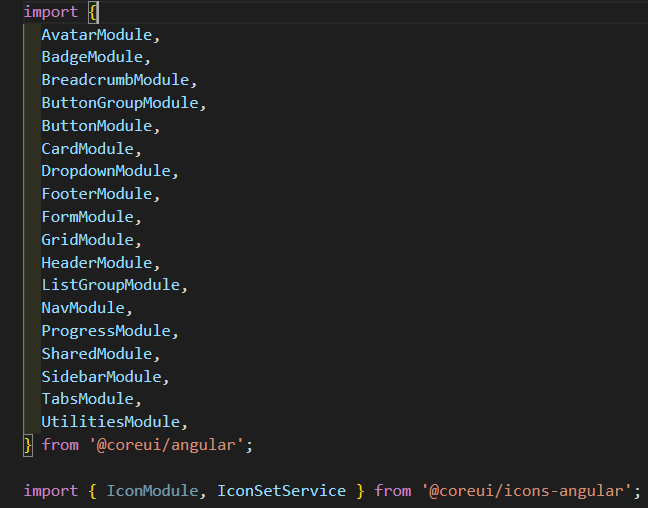
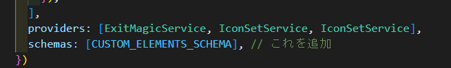
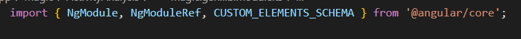

# tailwind css

# 導入

## パッケージとして導入する場合

デザインのパッケージなどがある場合はディレクトリ「プロジェクト名\ng\node_modules」直下にある
「@magic-xpa」フォルダを確認する。

もしローカルにない場合は、正しいフォルダをもらい「プロジェクト名\ng\node_modules」直下に設置する。

## 設定

### 吐き出す HTML に予め決まったクラスを付けたい場合

**確認する場所：プロジェクト名\ng\node_modules\ @magic-xpa\cli\templates\themes\使っているテーマ**

例）エトピリカのボタン

場所：C:\USER\MSJ-CRM-Web\ng\node_modules\@magic-xpa\cli\templates\themes\basicHTML\push-button.ejs


HTML タグはそのままデザインに反映されるので「class=""」の部分にクラス名を書きます。

## coreui を HTML 内で使えるようにする

1. 「magic.gen.lib.module.ts」フォルダを確認する
   ※フォルダそれぞれに存在する場合は、それぞれに記入すること
   －　「import ｛　｝from '@coreui/angular';」はありますか？

2. 無ければ記入してある「import」の最後に以下を記入する



```
import {
  AvatarModule,
  BadgeModule,
  BreadcrumbModule,
  ButtonGroupModule,
  ButtonModule,
  CardModule,
  DropdownModule,
  FooterModule,
  FormModule,
  GridModule,
  HeaderModule,
  ListGroupModule,
  NavModule,
  ProgressModule,
  SharedModule,
  SidebarModule,
  TabsModule,
  UtilitiesModule
} from '@coreui/angular';

import { IconModule, IconSetService } from '@coreui/icons-angular';

```

3. @NgModule ＞ imports: []，　直後に以下を追記する（@NgModule の囲い内側に）



```
  providers: [ExitMagicService, IconSetService, IconSetService],
  schemas: [CUSTOM_ELEMENTS_SCHEMA], // これを追加
```

4. 「import {} from '@angular/core';」があれば、以下の内容で上書きする



```
import { NgModule, NgModuleRef, CUSTOM_ELEMENTS_SCHEMA } from '@angular/core';
```
