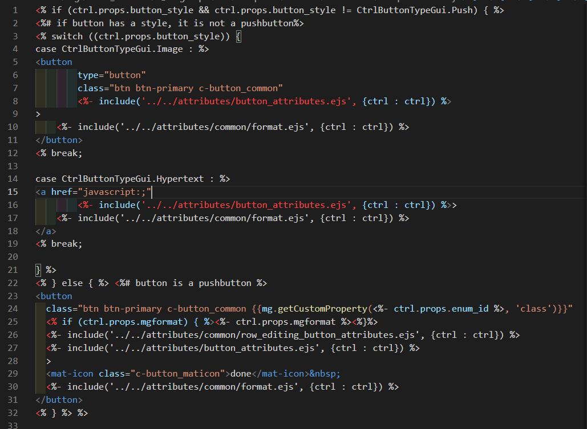

# tailwind css

## 導入

### パッケージとして導入する場合

デザインのパッケージなどがある場合はディレクトリ「プロジェクト名\ng\node_modules」直下にある
「@magic-xpa」フォルダを確認する。

もしローカルにない場合は、正しいフォルダをもらい「プロジェクト名\ng\node_modules」直下に設置する。

## 設定

### 吐き出す HTML に予め決まったクラスを付けたい場合

**確認する場所：プロジェクト名\ng\node_modules\ @magic-xpa\cli\templates\themes\使っているテーマ**

例）エトピリカのボタン

場所：C:\USER\MSJ-CRM-Web\ng\node_modules\@magic-xpa\cli\templates\themes\basicHTML\push-button.ejs

HTML タグはそのままデザインに反映されるので「class=""」の部分にクラス名を書きます。

## レイアウト
