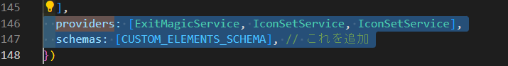

# tailwind css

# 導入

## パッケージとして導入する場合

デザインのパッケージなどがある場合はディレクトリ「プロジェクト名\ng\node_modules」直下にある
「@magic-xpa」フォルダを確認する。

もしローカルにない場合は、正しいフォルダをもらい「プロジェクト名\ng\node_modules」直下に設置する。

## 設定

### 吐き出す HTML に予め決まったクラスを付けたい場合

**確認する場所：プロジェクト名\ng\node_modules\ @magic-xpa\cli\templates\themes\使っているテーマ**

例）エトピリカのボタン

場所：C:\USER\MSJ-CRM-Web\ng\node_modules\@magic-xpa\cli\templates\themes\basicHTML\push-button.ejs


HTML タグはそのままデザインに反映されるので「class=""」の部分にクラス名を書きます。

## coreui を HTML で利用できるようにする設定

### 「magic.gen.lib.module.ts」を確認する

※上記ファイルがそれぞれのフォルダにある場合は、それぞれに記入する

1.  すでに記入されている「import」の最後に以下を追加する

.png>)

```
import {
  AvatarModule,
  BadgeModule,
  BreadcrumbModule,
  ButtonGroupModule,
  ButtonModule,
  CardModule,
  DropdownModule,
  FooterModule,
  FormModule,
  GridModule,
  HeaderModule,
  ListGroupModule,
  NavModule,
  ProgressModule,
  SharedModule,
  SidebarModule,
  TabsModule,
  UtilitiesModule,
} from '@coreui/angular';

import { IconModule, IconSetService } from '@coreui/icons-angular';

```

2. @NgModule ＞ imports:[　], が終わった直後に以下を入力する



```
  providers: [ExitMagicService,IconSetService,IconSetService],
  schemas:[CUSTOM_ELEMENTS_SCHEMA] // これを追加

```

3. ts ファイル一行目(「from '@angular/core'」の import)を以下の記述で上書きする

```
import { NgModule, NgModuleRef, CUSTOM_ELEMENTS_SCHEMA } from '@angular/core';
```
