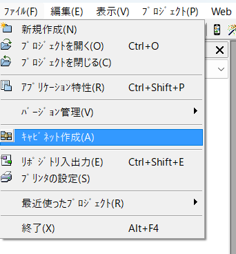
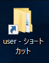
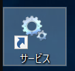
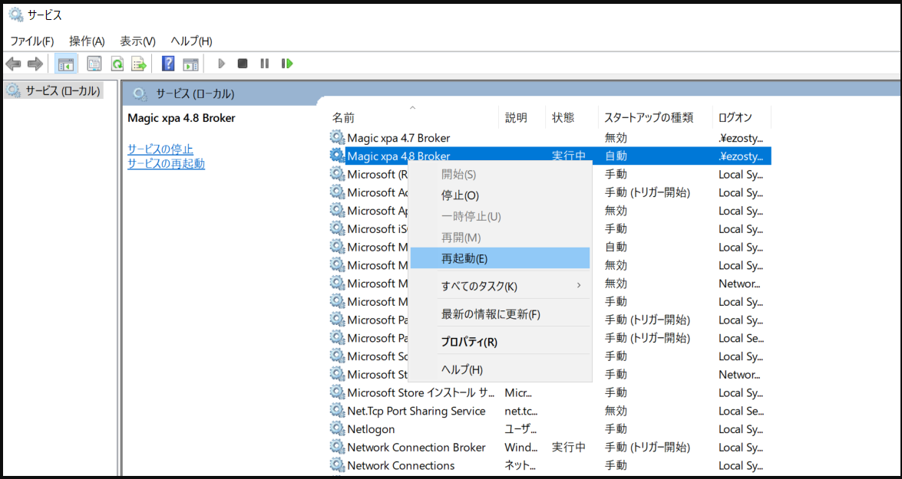
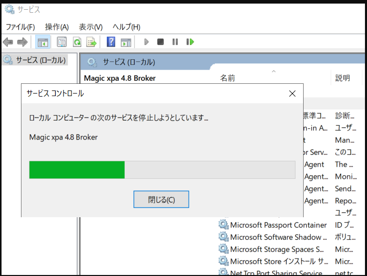

# 変更したシステムをデプロイする方法【Magic】

1.  該当のシステムを開き  
     ファイル＞キャビネット作成を行う  
    

1.  キャビネットを保存する場所を選択する＞保存したら Magic を閉じてよい  
    \*大抵は同じプロジェクトの中に保存すると見失いずらい

1.  デプロイしたいプロジェクトのサーバーを開く（リモートデスクトップ）

1.  user フォルダを開く（ショートカットがあればよし）  
    

1.  「○○○○.ecf」というファイルを探して、操作当日の日付をつけてリネームする

1.  ローカル環境で出力したキャビネットファイルを、コピー＆ペーストして user フォルダに移す

1.  「サービス」フォルダを開く  
    

1.  「Magic xpa ○.○ Broker」(○.○ はバージョンによって違う 4.8、4.9 など) かつ状態が「実行中」のファイルを探し  
    右クリックメニューから「再起動」を実行する
    

1.  サービスコントロースが動き、終わったら運用中の WebClient サイトを確認する  
    

# 変更したデザインをデプロイする方法【Anglar】

1. コンパイルします（コミットと同じタイミングでした方がいい）  
   コマンド【node --max-old-space-size=8192 ./node_modules/@angular/cli/bin/ng build --configuration production】

1. ローカルフォルダ【C:\USER\○○○○\ng】直下に「dist」フォルダができたことを確認します

1. 変更したいプロジェクトのリモートデスクトップへログインします

1. リモートデスクトップ【C:\inetpub\wwwroot】直下にバックアップ用フォルダを作成します

1. 中身のすべてのファイル(バックアップフォルダ以外)をコピーして、バックアップフォルダの中にコピーします

1. リモートデスクトップ【C:\inetpub\wwwroot】直下の「web.config」「assets」とバックアップしたフォルダのみを残し、そのほかのファイルを削除します

1. リモートデスクトップ【C:\inetpub\wwwroot\assets】直下の「server-config.json」のみを残して他のフォルダを削除します

1. ローカルフォルダ【C:\USER\○○○○\ng\dist】直下から ⑥⑦ で削除した分をコピーして、それぞれのリモートデスクトップ直下に張り付ける  
   ⑥ では「web.config」「assets」以外のファイルを張り付ける  
   ⑦ では「server-config.json」以外をのフォルダを張り付ける

※バックアップフォルダの保存期間はリモートデスクトップの容量によります
容量がある限り残しておいた方が無難だと思われます
