# 編集を始める ※必ず Magic 側で操作しましょう

（Magic と Anglar のフォルダが分かれてリモートにある場合は別です）

1. Git hub からプルしてきます
1. 自分用の Feature を分岐させて編集を始めます
   1. ファイルメニューから
      バージョン管理＞ Git Flow ＞ Git Flow の Feature の開始  
      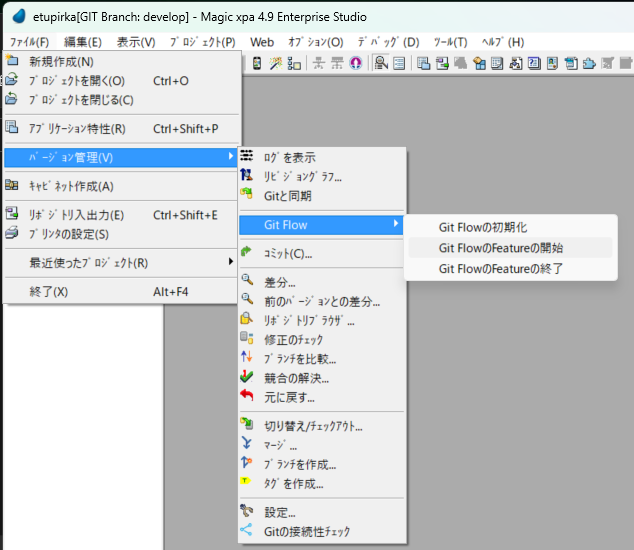
   1. 自分用の Feature 名をつける＞ＯＫボタン  
      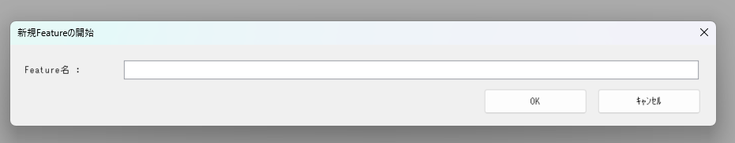
   1. Feature 名が設定したものだったら成功です  
      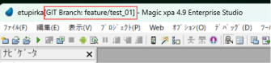

# 編集を終わる

1. コミットをする

   1. コミット先が自分用の Feature 名であることを確認します
   1. コメントを書きコミットします  
      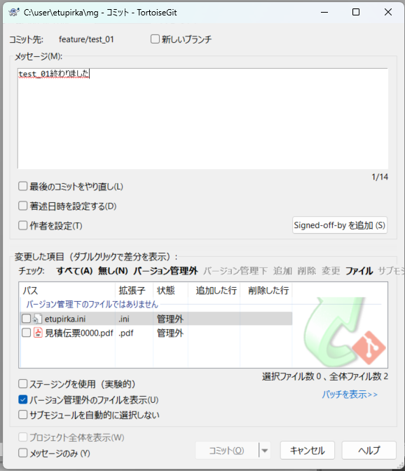
      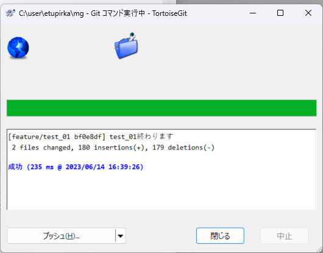

1. Feature を終了します

   1. ファイルメニューから
      バージョン管理＞ Git Flow ＞ Git Flow の Feature の終了  
      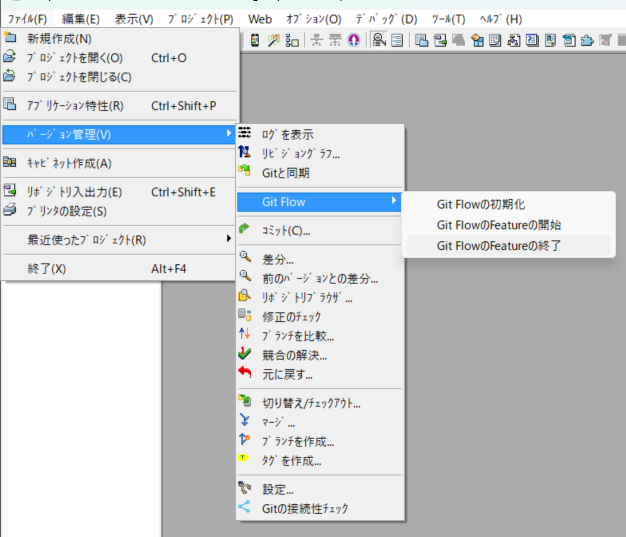
   1. Feature を開始したときにつけた名前を入力します  
      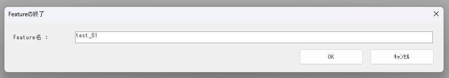
      以下の注意が出たら「はい」を押して待ちます  
      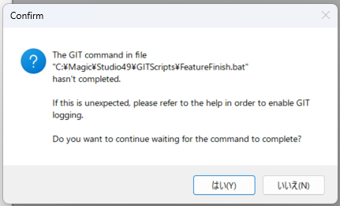
   1. ブランチが develop に戻っていることを確認します
      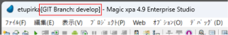

1. Git と同期をとる

   1. ファイルメニューから  
      バージョン管理＞ Git と同期  
      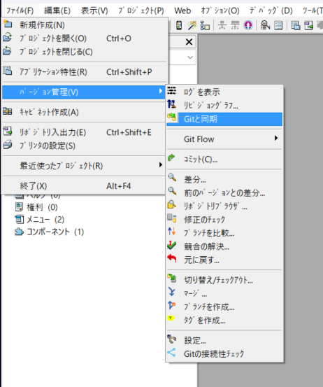

   ## ※「プッシュ」の前に必ず「プル」すること※

   そのままプッシュをすると自分も他の人も、コンフリクトを起こす可能性があります。  
   まずはプルしてきて自分のところでコンフリクトを解消しましょう。

   1. プッシュ画面＞「送り出しコミット」にコミットしたファイルを確認＞プッシュボタンを押します  
      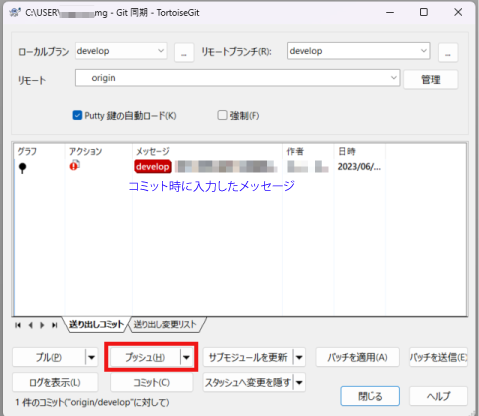

   1. 「成功」が表示されたら「閉じる」ボタンを押して完了します  
      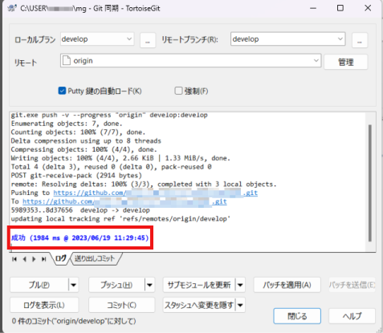
