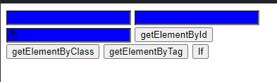

# javascript チートシート

```
<style>
  .push {
    background-color: red;
  }
  .blue {
    background-color: blue;
  }
</style>

<input id="InputA" class="Main classA" />
<input id="InputB" class="Main classB" />
<input id="InputC" class="Sub classC" />

<button onclick="ClickEvent_Id()">getElementById</button>
<button onclick="ClickEvent_Class()">getElementByClass</button>
<button onclick="ClickEvent_Tag()">getElementByTag</button>
<button onclick="ClickEvent_If(5)">If</button>


<div id="inner"></div>

<script>
  ClickEvent_Id = () => {
    var ElementInputA = document.getElementById("InputA");
    var ElementInner = document.getElementById("inner");
    ElementInner.innerHTML = ElementInputA.value;
  };
  ClickEvent_Class = () => {
    var ElementMain = document.getElementsByClassName("Main");
    console.log("MainClassの数は:" + ElementMain.length);
    for (let i = 0; i < ElementMain.length; i++) {
      ElementMain[i].classList.add("push");
    }
  };
  ClickEvent_Tag = () => {
    var ElementInput = document.getElementsByTagName("input");
    window.alert("Inputタグの数は:" + ElementInput.length);
    for (let i = 0; i < ElementInput.length; i++) {
        ElementInput[i].classList.add("blue");
    }
  };
  ClickEvent_If = (item) => {
    if(item == 5){
        window.alert('あっています');
    }
  };
</script>

```

上記コードを例に、以下に解説していきます。

## CSS スタイル

css のクラス名とその内容を決めています。  
CSS スタイルを決めるのは"style"タグで囲まれた中に書きます。  
class="push"が書かれている部分は「背景色が赤色」に。  
class="blue"が書かれている部分は「背景色が青色」になります。

```
<style>
  .push {
    background-color: red;
  }
  .blue {
    background-color: blue;
  }
</style>

```

## 入力フォーム javascript との関係

<style>
  .push {
    background-color: red;
  }
  .blue {
    background-color: blue;
  }
</style>

以下はインプット用フォームが 3 つ並んでいます。


```
<input id="InputA" class="Main classA" />
```

<input id="InputA" class="Main classA" />

InputA のフォーム：id="InputA"という画面内唯一の名前があり、クラスには Main と classA がついています

```
<input id="InputB" class="Main classB" />
```

<input id="InputB" class="Main classB" />

InputB のフォーム：id="InputB"という画面内唯一の名前があり、クラスには Main と classB がついています

```
<input id="InputC" class="Sub classC" />
```

<input id="InputC" class="Sub classC" />

InputC のフォーム：id="InputC"という画面内唯一の名前があり、クラスには Sub と classC がついています

## ボタンと javascript との関係

```
<button onclick="ClickEvent_Id()">getElementById</button>
```

<button onclick="ClickEvent_Id()">getElementById</button>

getElementById ボタン：ボタンがクリックされたとき「ClickEvent_Id()」という javascript が動きます。

```
<button onclick="ClickEvent_Class()">getElementByClass</button>
```

<button onclick="ClickEvent_Class()">getElementByClass</button>

getElementByClass ボタン：ボタンがクリックされたとき「ClickEvent_Class()」という javascript が動きます。

```
<button onclick="ClickEvent_Tag()">getElementByTag</button>
```

<button onclick="ClickEvent_Tag()">getElementByTag</button>

getElementByTag ボタン：ボタンがクリックされたとき「ClickEvent_Tag()」という javascript が動きます。

```
<button onclick="ClickEvent_If(5)">If</button>

```

<button onclick="ClickEvent_If(5)">If</button>

If ボタン：ボタンがクリックされたとき「ClickEvent_If()」という javascript が動きます。  
ここではあらかじめ「5」を「ClickEvent_If()」へ引き渡すようにしています。

## 表示する部分

```
<div id="inner"></div>
```

getElementById ボタンが押されたとき、InputA のフォームに書かれた内容が表示されます。


## javascript を定義している部分

いよいよ動きが表現される部分です。  
HTML 内に直接書き込む場合は、"script"タグで囲んだ中に書いていきます。

1. ClickEvent_Id:

```
  ClickEvent_Id = () => {
    var ElementInputA = document.getElementById("InputA");
    var ElementInner = document.getElementById("inner");
    ElementInner.innerHTML = ElementInputA.value;
  };

```

### 意味

- = () => ：アロー関数と言い、関数式（関数リテラル）をさらに簡易的に記述するために用いられる技法です。  
  function を利用しない代わりに、引数(ここでは”ClickEvent_Id”)の直後に "=>" を記述し、引数がない関数の場合には、必ず "( )" を記述する必要があります。

- var：プログラムで利用する変数を宣言するための命令の１つです。「var 変数名 = 値」

- document.：HTML ドキュメントを表現するオブジェクトです。直後にメソッドを書くことで行う内容が変わります。
  

- innerHTML：html で使われているタグの中身を取得・変更できる、javascript のプロパティです

### 解説

- ボタンがクリックされたときに実行される関数です。
- "InputA"という id を持つ要素[`<input id="InputA" class="Main classA" />`]と"inner"という id を持つ要素[`<div id="inner"></div>`]を取得します。
- "inner"要素[`<div id="inner"></div>`]の innerHTML を  
  "InputA"要素の value (フォームに書かれた内容)で上書きします。


2. ClickEvent_Class:

```
  ClickEvent_Class = () => {
    var ElementMain = document.getElementsByClassName("Main");
    console.log("MainClassの数は:" + ElementMain.length);
    for (let i = 0; i < ElementMain.length; i++) {
      ElementMain[i].classList.add("push");
    }
  };

```

### 意味

- console.log：コンソール部分に以降()内の内容を表示させます。F12 キーで確認！
- (要素 ＋ 要素)：要素同士をくっつけて表示することができます。
- 文字列.length：主に文字列の長さや配列の要素数を取得することができるプロパティです。
- for：指定した回数だけ繰り返し処理を行うことができます。  
  for 文ではまず最初に初期化式を 1 回実行します。(実行されるのは 1 回だけ)  
  「for (初期化式; 条件式; 変化式)」  
  「 let i = 0 」=初期化式、「i < ElementMain.length」=条件式、「i++」=変化式
- i++：「変数「i」に値を１追加する」という意味です。(「++」はインクリメント演算子といいます)
- classList：指定した要素の class 属性をリストで返すプロパティです。追加や削除、切り替えなどができます。(.add("push")：「push」という class を追加しています)

### 解説

- ボタンがクリックされたときに実行される関数です。
- "Main"というクラス名を持つ要素(input id="InputA"と input id="InputB")を取得します。
- "MainClass の数は: [要素の数]"というメッセージをコンソールに表示します。
- 取得した要素のそれぞれに対して、"push"(` .push {
  background-color: red;
}`)というクラスを追加します。
  
  

3. ClickEvent_Tag:

```
  ClickEvent_Tag = () => {
    var ElementInput = document.getElementsByTagName("input");
    window.alert("Inputタグの数は:" + ElementInput.length);
    for (let i = 0; i < ElementInput.length; i++) {
        ElementInput[i].classList.add("blue");
    }
  };

```

### 意味

- window：画面上に表示されているすべてのオブジェクトの親となるオブジェクトので、JavaScript のオブジェクト階層の最上位に位置します。  
  ウィンドウに関する情報の取得や、ウィンドウを設定・操作します。
- alert：alert メソッドは任意のテキストメッセージをポップアップで画面に表示します。  
  「alert( 画面に表示させたい値 )」

### 解説

- ボタンがクリックされたときに実行される関数です。
- "input"というタグ名を持つ要素を取得します。
- "Input タグの数は: [要素の数]"というメッセージをアラートで表示します。
- 取得した要素のそれぞれに対して、"blue"(`.blue {
  background-color: blue;
}`)というクラスを追加します。

  


4. ClickEvent_If:

```
  ClickEvent_If = (item) => {
    if(item == 5){
        window.alert('あっています');
    }
  };

```

### 意味

- if：分岐処理を行うために IF を使います。

```
if( 条件式 ) {
    //trueの場合の処理を書く
}
```

- (item == 5)：等価演算子と言い「 item が 5 が同じ」という使い方をします。

### 解説

- ボタンがクリックされたときに実行される関数です。
- 引数として渡された item が 5 と等しいかどうかを判定します。
- もし等しい場合は、"あっています"というメッセージをアラートで表示します。
- このコードでは予め「5」を渡すようにしているので、アラートが表示されます。


