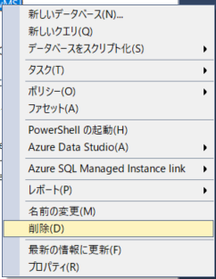
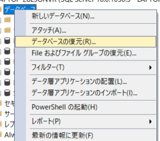
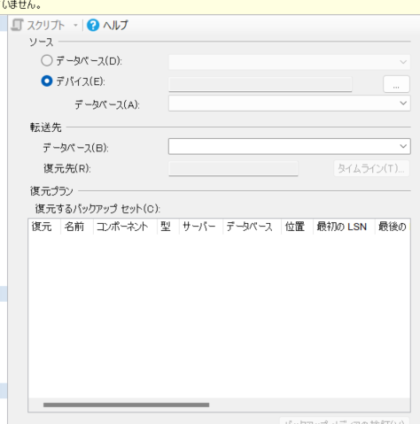
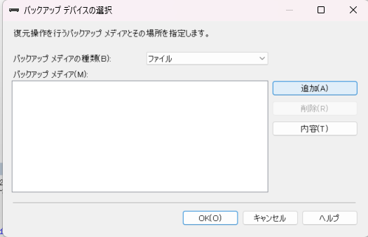
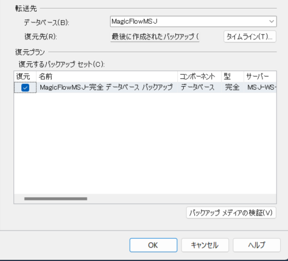
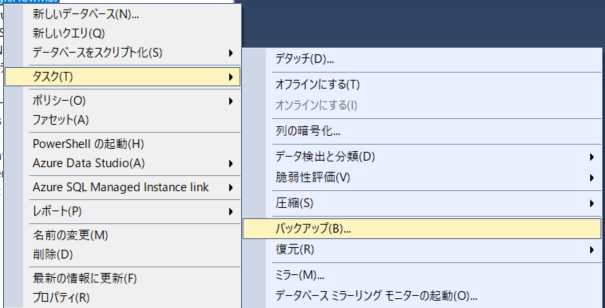
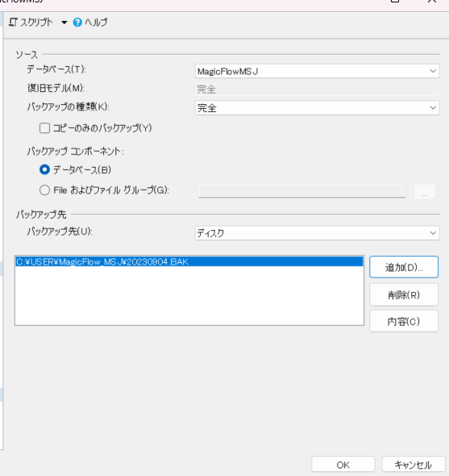
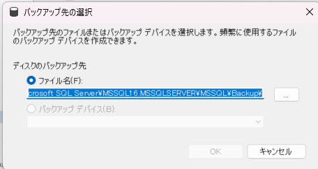
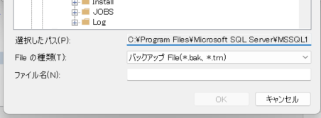

# 差し替えたいデータが手元にある場合

1. 該当のデータベースがあるサーバーを選びます
1. 「データベース」を展開し、すでに差し替え元のデータベースがある場合は削除します

   1. 差し替え元のデータベースを選択し右クリック
   1. メニュー内の「削除」をクリック
      

1. データベースフォルダを選択し右クリック、メニューから「データベースの復元」を選択します
   

1. データベースの復元方法
    1.ソースの「デバイス」を選択し「...」ボタンからバックアップデバイスの選択へ移動します
    1. 「追加ボタン」から上書きしたいバックアップファイルを選び、バックアップメディアに追加します
    1. 転送先が希望のデータベース名になっていることを確認します。復元プランの復元チェックボックスにもチャックをいれてください

1. 完了です

# データのバックアップをとる

1. バックアップを取りたいデータベースを選択して、右クリックメニューから「タスク」>「バックアップ」のメニューを選びます
   

1. ソースの名前や設定を確認してバックアップ先を指定します
   
1. 「追加ボタン」からバックアップ先フォルダを指定して、ファイル名を付けます
   
   
1. バックアップが完成すると指定したフォルダの中にバックアップファイルが出来上がっています
