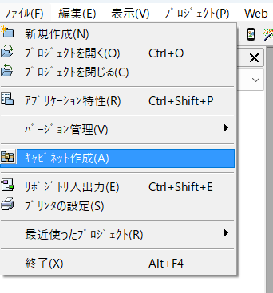
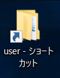
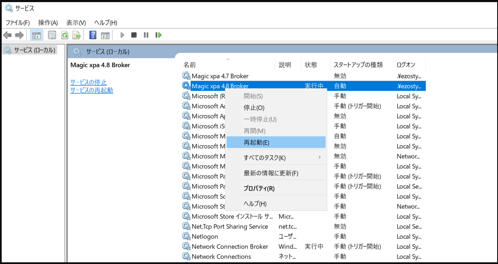

# 変更したシステムをデプロイする方法【Magic】

1.  該当のシステムを開き  
     ファイル＞キャビネット作成を行う  
    

1.  キャビネットを保存する場所を選択する＞保存したら Magic を閉じてよい  
    \*大抵は同じプロジェクトの中に保存すると見失いずらい

1.  デプロイしたいプロジェクトのサーバーを開く（リモートデスクトップ）

1.  user フォルダを開く（ショートカットがあればよし）  
    

1.  「○○○○.ecf」というファイルを探して、操作当日の日付をつけてリネームする

1.  ローカル環境で出力したキャビネットファイルを、コピー＆ペーストして user フォルダに移す

1.  「サービス」フォルダを開く  
    

1.  「Magic xpa ○.○ Broker」(○.○ はバージョンによって違う 4.8、4.9 など) かつ状態が「実行中」のファイルを探し  
    右クリックメニューから「再起動」を実行する
    

1.  サービスコントロースが動き、終わったら運用中の WebClient サイトを確認する  
    

# 変更したデザインをデプロイする方法【Anglar】
